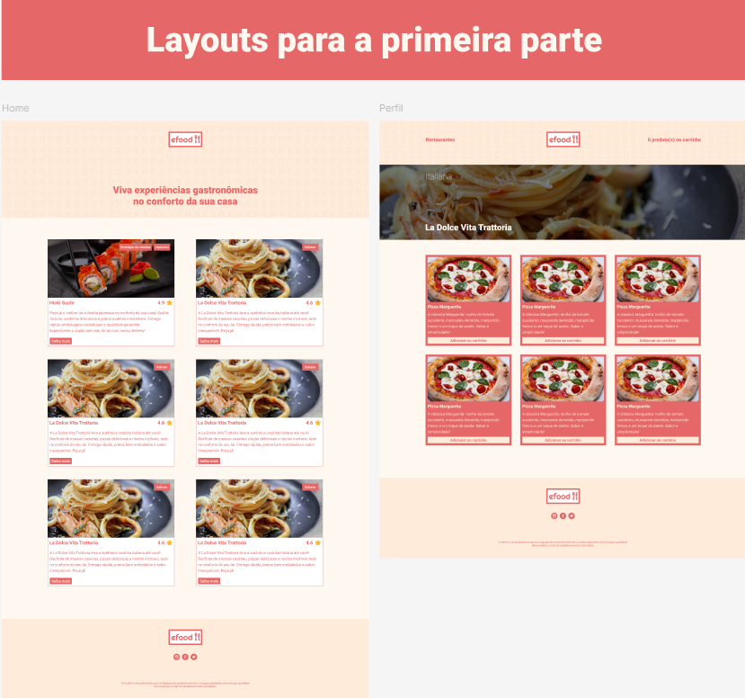

# :hammer: EM CONSTRUÇÃO :hammer:

## Primeira Parte do Projeto

Baseado no design disponibilizado como a imagem acima e nos requisitos abaixo:
 
- Criar um novo projeto React;
- Utilizar como biblioteca o Styled Component para estilização;
- Utilizar como biblioteca o React Router para a navegação entre páginas;
- Criar um novo repositório para o projeto;
- Subir as alterações no repositório;
- Criar um projeto na Vercel;
 
 
Link do projeto no Vercel: https://efood-inky-six.vercel.app/
